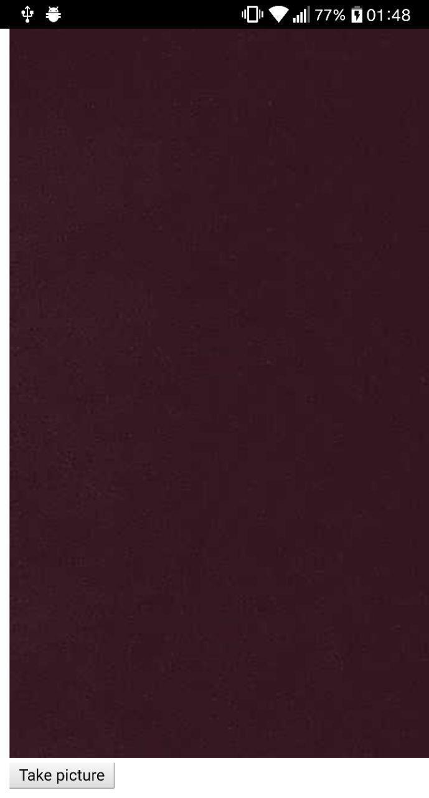

# cordova-react-issue

Investigating why would react fail on take a picture and display it.

## tl;dr;

It doesn't fail.

## steps

First clone this repo and perform `npm install`

Make sure you have the latest cordova installed:

```bash
sudo npm -g install cordova
```

Then plug you development phone on your machine and do `npm run android`.
If you work with **ios** hack a while the **package.json**.

| before pushing the button | after accepting the picture |
| ------------------------- | --------------------------- |
|      |          |
